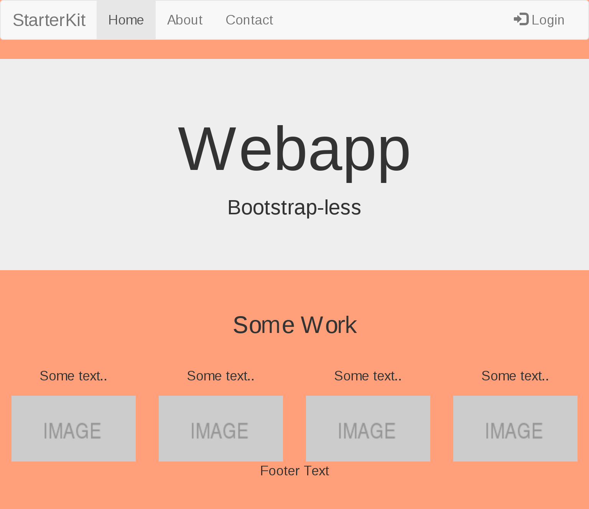

# Simple Javascript Application Starterkit



### Installation

```
npm install
```

### Start Webpack Development Server

```
npm run dev
```

### Build Production Version

```
npm run build
```

### Features:

* [webpack](https://github.com/webpack/webpack)
* [babel-loader](https://github.com/babel/babel-loader)
* [sass-loader](https://github.com/webpack-contrib/less-loader)
* [autoprefixer](https://github.com/postcss/autoprefixer)

#
<small>Credits: [Ihatetomatoes](https://www.youtube.com/playlist?list=PLkEZWD8wbltnRp6nRR8kv97RbpcUdNawY), [hackernoon](https://hackernoon.com/a-tale-of-webpack-4-and-how-to-finally-configure-it-in-the-right-way-4e94c8e7e5c1)</small>
