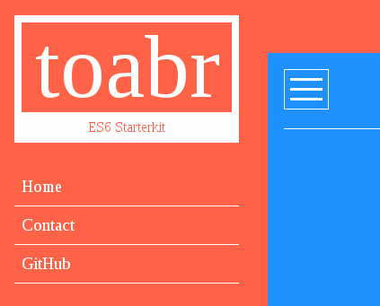

# Simple Javascript Application Starterkit



### Installation

```
npm install
```

### Start Dev Server

```
npm run dev
```

### Build Prod Version

```
npm run build
```

### Features:

* ES6 Support via [babel-loader](https://github.com/babel/babel-loader)
* LESS Support via [less-loader](https://github.com/webpack-contrib/less-loader)

#
<small>Credits: [Traversy Media](https://www.youtube.com/channel/UC29ju8bIPH5as8OGnQzwJyA)</small>
